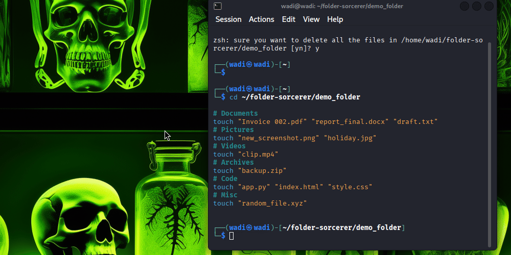

# 🧙‍♂️ Folder Sorcerer v1.0

**Automate your messy Downloads folder like magic!**  
No more chaos. No more endless dragging and dropping. Folder Sorcerer organizes your files by **type, year, and month**, and even renames screenshots to avoid conflicts. All in **one click**.

---

## 🚀 Features

- Automatically organizes files into:
  - **Videos**, **Pictures**, **Documents**, **Others/Misc**
- Sorts files by **creation year/month**
- Renames screenshots to **timestamp format**
- Works **directly on your desktop** (no virtual environment required)
- Optional **fancy terminal output** with `rich`

---

## 🎬 Demo GIF

Here’s Folder Sorcerer in action:



---

## 💻 Installation

1. Clone the repo:
```bash
git clone https://github.com/howard-dominic/folder-sorcerer.git
cd folder-sorcerer
